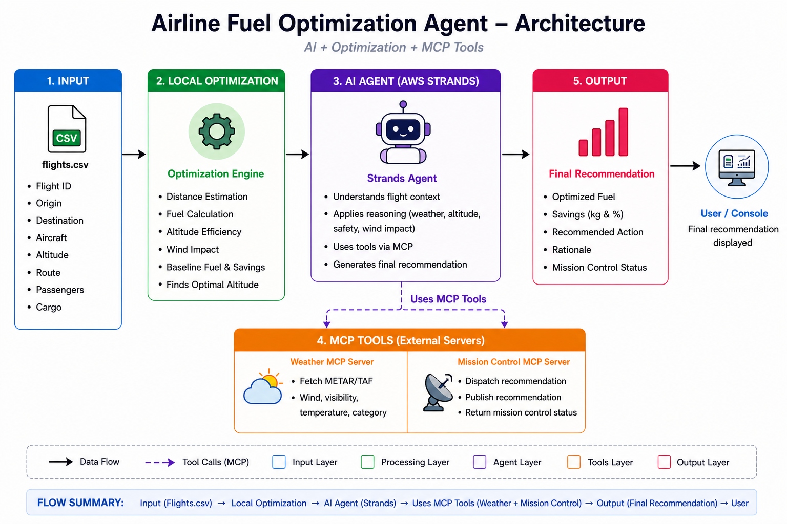

# Airline Fuel Optimization Agent (AWS Strands + MCP)
This project builds an intelligent fuel optimization agent that combines traditional optimization with LLM reasoning using AWS Strands and MCP. It analyzes flight, weather, and aircraft data to generate efficient routing and altitude recommendations, improving fuel efficiency and operational decision-making. 

---

##  Project Demo
 [Watch Explanation Video](LINK)

---

##  Architecture



The system follows a layered architecture:

1. **Input Layer**
   - Flight data from CSV(data/flights.csv)

2. **Optimization Layer**
   - Distance estimation
   - Fuel consumption calculation
   - Baseline optimization

3. **Agent Layer (AWS Strands)**
   - LLM reasoning via Ollama
   - Applies reasoning:
     - Altitude efficiency
     - Wind impact
     - Safety constraints(IFR/LIFR)

4. **MCP Tool Layer**
   - Weather MCP → fetch METAR/TAF data
   - Mission Control MCP → publish recommendations  

5. **Output Layer**
   - Structured JSON output
   - CLI summary table (via Rich)
   - Optional Streamlit UI  

---

## Tech Stack

- Language: Python 3.11+
- Agent Framework: AWS Strands
- Protocol: MCP (Model Context Protocol)
- LLM Runtime: Ollama
- Weather API: AviationWeather (METAR/TAF)
- UI: Streamlit (optional)
- CLI: Rich
- Containerization: Docker

---

## Project Structure

```
Airline-Project/
│
├── main.py                  # Entry point (pipeline execution)
├── app.py                   # Streamlit UI (optional)
├── optimization.py          # Fuel optimization logic
│
├── agent/
│   └── agent.py             # Strands agent setup
│
├── mcp_servers/
│   ├── weather_server.py    # Weather MCP server
│   └── mission_control.py   # Mission dispatch MCP server
│
├── data/
│   └── flights.csv          # Sample flight data
│
├── images/
│   └── architecture.png
│
├── Dockerfile
├── requirements.txt
└── README.md


```

---

##  Setup

### 1. Clone the Repository
```bash
git clone https://github.com/ya-sonia/Airline-fuel-optimization-agent.git
cd Airline-fuel-optimization-agent
```

---

### 2. Create Virtual Environment
```bash
python3 -m venv airline-venv
```

#### Activate:

- **Mac/Linux**
```bash
source airline-venv/bin/activate
```

- **Windows**
```bash
airline-venv\Scripts\activate
```

---

### 3. Install Dependencies
```bash
pip install -r requirements.txt
```

---

### 4. Setup Ollama (Local Installation)

#### Install Ollama  
Download from: https://ollama.com/download  

- Windows → `.exe`  
- Mac → `.dmg`  

Verify installation:
```bash
ollama --version
```

---

#### Download LLM Model
```bash
ollama pull llama3.1
```

 Model size: ~4.9 GB (one-time download)

---

#### Start Ollama
```bash
ollama serve
```

 If already running, skip this step

Check:
```bash
curl http://localhost:11434
```

Expected output:
```
Ollama is running
```

---

### 5. Run the Project
```bash
python main.py
```

---

###  Optional: Run Single Flight
```bash
python main.py --flight AI101
```
---
### 6. Run UI (Optional)
```bash
streamlit run app.py
```

---
## Docker

Build

```bash
docker build --network=host -t airline-fuel-optimization-agent .
```


---

##  Example Input

```csv
flight_id,origin,destination,aircraft,route,altitude,passengers,cargo_kg
AI101,DEL,BOM,A320,DEL-NAG-BOM,35000,180,2000
AI202,BLR,DEL,B737,BLR-HYD-DEL,36000,160,1500
AI303,MUM,DXB,A320,MUM-KAR-DXB,37000,170,2200
```

---

##  Example Output

```json
{
  "flight_id": "AI101",
  "origin": "DEL",
  "destination": "BOM",
  "original_fuel": 1647.6,
  "optimized_fuel": 1614.6,
  "savings_kg": 33.0,
  "savings_pct": 2.0,
  "recommended_action": "Increase altitude to FL370",
  "rationale": "Higher altitude improves lift-to-drag ratio, reducing fuel burn. Wind impact is minimal and conditions are safe (VFR).",
  "mission_control_status": "sent"
}
```

---

##  How It Works

1. Load flight data from CSV  
2. Run local fuel optimization  
3. Agent fetches weather via MCP  
4. Apply LLM reasoning using Strands
5. Generate recommendations  
5. Publish to mission control MCP
6. Display results  

---

##  Features

- Fuel optimization based on aircraft + route
- Weather-aware decision making
- Agent-based reasoning (LLM + rules)
- MCP tool integration
- Modular architecture
- CLI + UI support
- Dockerized deployment

---

 


